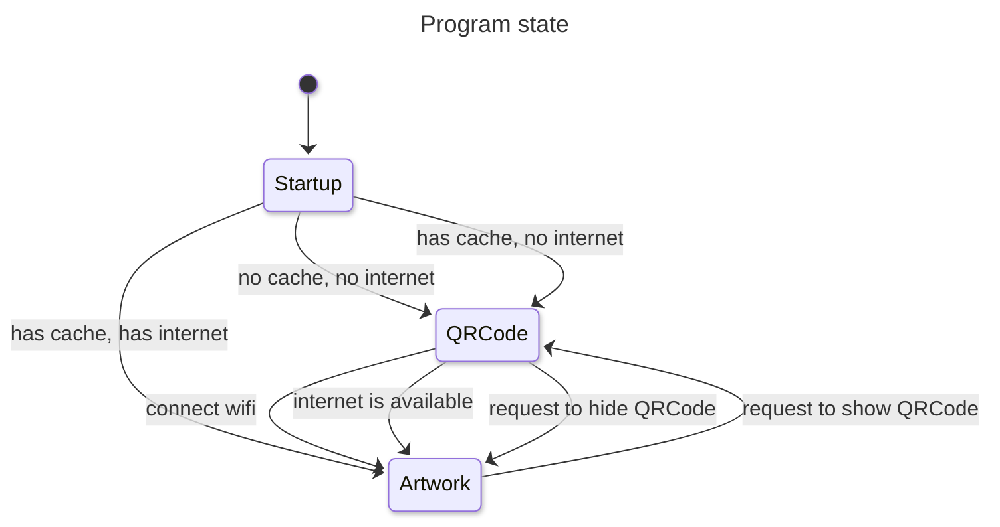

# Flow

```mermaid
---
config:
  theme: mc
  layout: dagre
  look: neo
title: Program state
---
stateDiagram
  direction TB
  [*] --> Startup
  Startup --> QRCode:no cache, no internet
  Startup --> QRCode:has cache, no internet
  Startup --> Artwork:has cache, has internet
  QRCode --> Artwork:connect wifi
  QRCode --> Artwork:internet is available
  QRCode --> Artwork:request to hide QRCode
  Artwork --> QRCode:request to show QRCode

```
